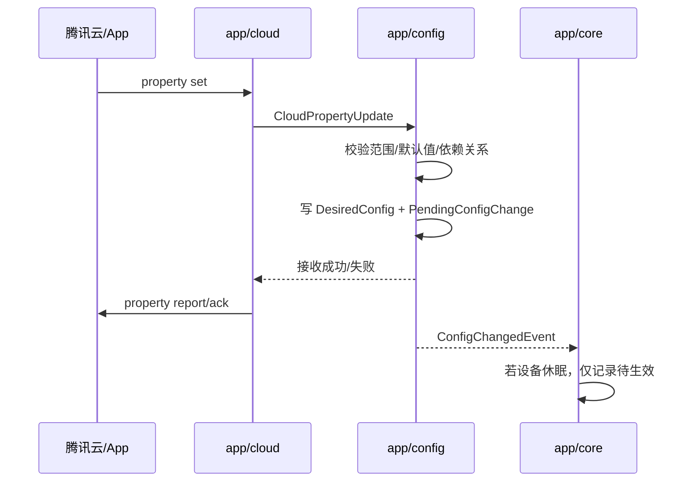
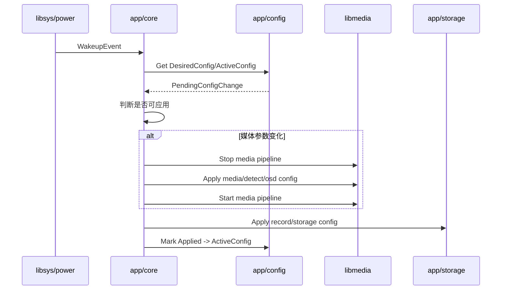
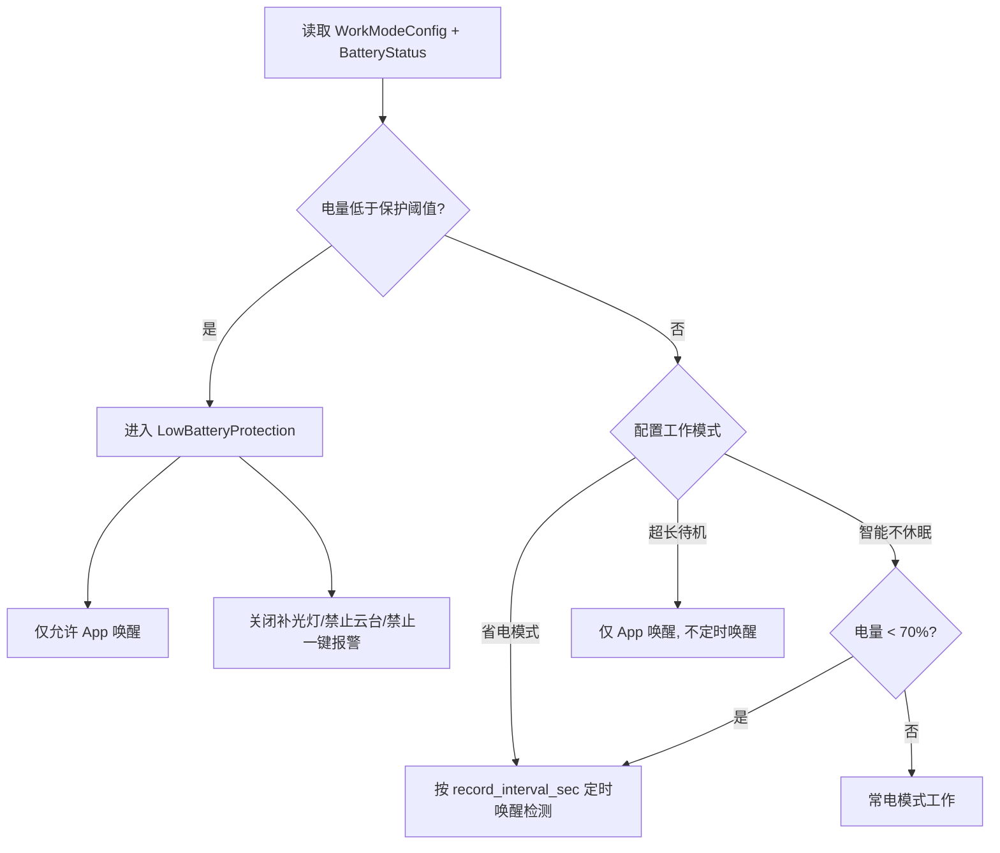

# AOV 配置与模块交互设计

本文用于把 `CS6GV2.0.xlsx` 中的软件需求配置项落到当前 AOV 架构。目标是先明确配置模型、模块边界、交互结构体和生效规则，再进入 `app/core`、`app/config`、`app/cloud` 的实现。

参考输入：

- `docs/CS6GV2.0.xlsx`
- `docs/AOV_设计文档.html`
- `Z:\cp3prov1.2\Apps\Kylin\comps\Cloud`
- `Z:\cp3prov1.2\Apps\Kylin\comps\Cloud\TencentCloud_SDK\include`

## 1. 需求表结构

`CS6GV2.0.xlsx` 当前包含两个 sheet：

- `软件`：203 条需求行，字段为一级模块、二级模块、三级模块、需求描述、限制、选项、默认值、App。
- `硬件`：25 条硬件约束，包含主控、sensor、电机、4G、SD 卡槽、电池、工作模式、极低电量管理等。

软件一级模块分布：

| 一级模块 | 行数 | 主要落地模块 |
| --- | ---: | --- |
| 图像 | 44 | `app/config`、`libmedia/isp`、`libmedia/osd`、`libsys/device` |
| 编码 | 26 | `app/config`、`libmedia/venc/aenc`、`app/cloud` |
| 报警 | 55 | `app/config`、`app/alarm`、`libmedia/detect`、`app/cloud`、`app/storage` |
| 网络 | 10 | `app/config`、`libsys/modem`、`app/cloud` |
| 系统 | 26 | `app/config`、`app/core`、`libsys/device`、`app/cloud` |
| 工作模式 | 6 | `app/config`、`app/core`、`libsys/power`、`libmedia`、`app/storage` |
| 电池管理 | 2 | `libsys/power`、`app/core`、`app/cloud` |
| 云台 | 14 | `app/config`、`libsys/device`、`app/cloud` |
| 配网 | 3 | `app/config`、`libsys/modem`、`app/cloud` |
| 录像 | 17 | `app/config`、`app/storage`、`libsys/SD`、`app/cloud` |

## 2. 总体配置模型

AOV 设备允许在休眠期间通过 App/云端修改配置，但普通配置不应单独唤醒设备。配置模型拆成三层：

```cpp
struct DesiredConfig;      // 云端/App 期望配置，可在设备休眠时更新
struct ActiveConfig;       // 设备当前已应用配置，只能由设备应用成功后更新
struct PendingConfigChange;// 待应用配置变更，记录来源、版本、需要重启/重启链路等
```

核心规则：

- `app/cloud` 接收腾讯云物模型属性下发或动作命令。
- `app/config` 负责校验、归一化、持久化 `DesiredConfig`。
- `app/core` 在 PIR、定时、App 远程唤醒、开机启动等时机拉取 `DesiredConfig`，决定是否应用。
- 媒体参数变更需要 `停止媒体链 -> 应用配置 -> 重启媒体链`。
- 低功耗录像间隔、工作模式、电量保护阈值属于 AOV 主状态机参数，由 `app/core` 决策生效。
- 进入 AOV 休眠前必须确认本机配置持久化完成。未应用成功的配置保留为待生效。

## 3. 核心结构体草案

### 3.1 配置版本与来源

```cpp
enum class ConfigSource {
    FactoryDefault,
    LocalPersisted,
    CloudDesired,
    AppCommand,
    RuntimePolicy,
};

enum class ConfigApplyState {
    Pending,
    Applied,
    Rejected,
    NeedMediaRestart,
    NeedDeviceReboot,
    Failed,
};

struct ConfigVersion {
    uint64_t version {0};
    uint64_t updated_ts_ms {0};
    ConfigSource source {ConfigSource::FactoryDefault};
};

struct ConfigApplyResult {
    ConfigApplyState state {ConfigApplyState::Pending};
    std::string field;
    std::string reason;
};
```

### 3.2 AOV 工作模式配置

需求来源：软件 sheet 行 164-169，硬件 sheet 行 23-24。

```cpp
enum class ConfiguredWorkMode {
    PowerSaving,       // 省电模式
    SmartNoSleep,      // 智能不休眠模式
    UltraLongStandby,  // 超长待机模式
};

enum class RuntimeProtectionState {
    None,
    LowBatteryProtection,
};

struct WorkModeConfig {
    ConfiguredWorkMode mode {ConfiguredWorkMode::PowerSaving};

    // 行 165：省电模式录像间隔，可选 1/3/5 秒，默认 1 秒。
    int record_interval_sec {1};

    // 行 166：智能不休眠模式，低于 70% 进入省电模式，高于 80% 恢复常电模式。
    int smart_enter_power_saving_pct {70};
    int smart_resume_no_sleep_pct {80};

    // 行 168-169：极低电量保护，阈值 5%-30%，默认 10%，高于阈值+10%退出。
    int low_battery_protect_threshold_pct {10};
    int low_battery_exit_hysteresis_pct {10};
};
```

设计约定：

- `ConfiguredWorkMode` 是用户配置，不包含极低电量保护。
- 极低电量保护是运行态保护，由 `app/core` 根据电量和阈值进入。
- 超长待机模式仅支持 App 唤醒，不自动定时唤醒。
- 极低电量保护期间：不自动定时唤醒，仅支持 App 唤醒，不支持云台操作，不支持一键报警，关闭补光灯。

### 3.3 电池状态

需求来源：软件 sheet 行 170-171。

```cpp
struct BatteryStatus {
    int percent {100};          // 1%-100%
    bool charging {false};      // 充电中 / 未充电
    bool low_battery_protect {false};
    uint64_t updated_ts_ms {0};
};
```

模块归属：

- `libsys/power` 采集电量和充电状态。
- `app/core` 计算是否进入 `LowBatteryProtection`。
- `app/cloud` 每天上报电量，并在状态变化时上报。

### 3.4 编码配置

需求来源：软件 sheet 行 47-72。

```cpp
enum class StreamProfile {
    Main,
    Sub,
};

enum class VideoEncodeType {
    H264,
    H265,
};

enum class BitrateControlMode {
    CBR,
    VBR,
};

struct VideoStreamConfig {
    StreamProfile stream {StreamProfile::Main};
    VideoEncodeType codec {VideoEncodeType::H265};
    int width {2560};
    int height {1440};
    int fps_normal {15};      // 报警及唤醒模式，默认 15fps
    int fps_aov {1};          // AOV 模式，可选 1/2/3fps，默认 1fps
    BitrateControlMode bitrate_mode {BitrateControlMode::VBR};
    int bitrate_kbps {1024};
    int gop {60};
};

enum class AudioEncodeType {
    G711A,
    G711U,
    AAC,
};

struct AudioConfig {
    bool enabled {true};
    AudioEncodeType codec {AudioEncodeType::G711A};
    int sample_rate_khz {8};
    int bit_depth {16};
    int input_volume {100};
    int output_volume {100};
};

struct MediaEncodeConfig {
    VideoStreamConfig main_stream;
    VideoStreamConfig sub_stream;
    AudioConfig audio;
};
```

约束：

- 主码流分辨率：2560x1440 默认，备选 2304x1296、1920x1080、1280x720。
- 子码流分辨率：768x432 默认，备选 640x360。
- AOV 模式帧率：1/2/3fps。
- 报警及唤醒模式帧率：1-15fps，默认 15fps。
- 云端直播/云存需要从该配置映射到腾讯云 `iv_cm_av_data_info_s`。

### 3.5 报警与检测配置

需求来源：软件 sheet 行 73-127。

```cpp
enum class DetectTargetType {
    Human,
    Vehicle,
    NonMotorVehicle,
    Motion,
    Occlusion,
};

enum class SensitivityLevel {
    Low,
    Middle,
    High,
};

struct DetectRegion {
    // Human/Vehicle/NonMotorVehicle 使用四边形区域，默认全屏。
    // Motion 使用 18x22 网格。
    bool full_screen {true};
    std::vector<int> points_or_cells;
};

struct TimeRangeMinutes {
    int start_minute {0};
    int end_minute {24 * 60};
};

struct ArmSchedule {
    // 每天最多 8 个时段，默认 7*24。
    std::vector<TimeRangeMinutes> daily_ranges[7];
};

struct AlarmLinkageConfig {
    bool trigger_record {true};
    bool push_message {true};
    bool white_light_alarm {false};
    bool sound_alarm {false};
};

struct DetectRuleConfig {
    DetectTargetType type {DetectTargetType::Human};
    bool enabled {true};
    DetectRegion region;
    int sensitivity {60};         // 上报 1-25低，26-75中，76-100高；下发低20/中60/高80。
    int debounce_sec {10};
    ArmSchedule schedule;
    AlarmLinkageConfig linkage;
    bool static_filter {false};   // 车辆/非机动车静止过滤。
};

struct AlarmConfig {
    DetectRuleConfig human;
    DetectRuleConfig vehicle;
    DetectRuleConfig non_motor_vehicle;
    DetectRuleConfig motion;
    DetectRuleConfig occlusion;
    int white_light_duration_sec {10};
    int sound_repeat_count {1};
    bool target_box_overlay {false};
    bool target_zoom {false};
    bool alarm_snapshot_enabled {true};
};
```

模块归属：

- `app/config` 保存和校验检测配置。
- `app/alarm` 把检测事实转换成告警事件，并执行防抖、布防时间、联动策略。
- `libmedia/detect` 只关心实际检测参数，如目标类型、区域、灵敏度。
- `app/storage` 根据联动策略启动报警录像。
- `app/cloud` 上报告警消息、抓图、录像索引。

### 3.6 录像与存储配置

需求来源：软件 sheet 行 189-205。

```cpp
enum class SdCardStatus {
    Normal,
    NotDetected,
    NotFormatted,
    Formatting,
    Error,
};

enum class RecordType {
    Aov,
    Normal,
    Alarm,
};

struct SdStorageConfig {
    bool record_enabled {true};
    bool loop_record {true};
    int min_capacity_gb {8};
    int max_capacity_gb {512};
};

struct RecordScheduleConfig {
    // 一周七天，每天最多 8 段，粒度分钟。
    ArmSchedule schedule;
    RecordType default_record_type {RecordType::Normal};
    int alarm_post_record_sec {5}; // 可选 3/5/10 秒。
};

struct CloudStorageConfig {
    bool enabled {false};
    RecordType record_type {RecordType::Alarm};
};

struct StorageRuntimeStatus {
    SdCardStatus sd_status {SdCardStatus::NotDetected};
    uint64_t total_bytes {0};
    uint64_t free_bytes {0};
    int format_progress {0};
    bool aov_ddr_batch_write_enabled {true};
};

struct RecordConfig {
    SdStorageConfig sd;
    RecordScheduleConfig schedule;
    CloudStorageConfig cloud_storage;
};
```

当前实现状态：

- `app/packet -> app/storage -> app/storage/dhfs` 主链已搭建。
- `DhfsWriterStub` 只做统计。
- 真实 `PS/PES + DHFS` 写盘作为下一任务，且需要单独设计 AOV 间隔帧时间轴。

重要约束：

- 行 195：AOV 录像需要从 DDR 缓存多帧后一次写入。
- AOV 低功耗场景不是连续写入，不能直接照搬旧 `PSEncapsulation` 连续时间戳逻辑。
- SD 卡状态、格式化进度、异常原因需要上报云端/App。

### 3.7 图像、OSD、补光灯配置

需求来源：软件 sheet 行 3-46。

```cpp
struct ImageParamConfig {
    int brightness {50};
    int contrast {50};
    int saturation {50};
    int sharpness {50};
    bool mirror {false};
    bool anti_flicker {false};
    std::string video_standard {"NTSC"};
};

struct OsdConfig {
    bool show_name {true};
    bool show_time {true};
    bool show_week {true};
    bool show_tenda_logo {true};
    std::string channel_name {"CS6GV2.0"};
    std::string time_format {"24h"};
    std::string date_format {"YYYY-MM-DD"};
    std::string font_size {"auto"};
};

enum class FillLightMode {
    Off,
    Auto,
    Manual,
};

struct FillLightConfig {
    FillLightMode mode {FillLightMode::Auto};
    int brightness {50};
};
```

模块归属：

- ISP 图像参数进入 `libmedia/isp`。
- OSD 参数进入 `libmedia/osd`。
- 补光灯硬件控制进入 `libsys/device`，由 `app/core` 在极低电量保护时强制关闭。

### 3.8 系统、网络、云台配置

这些配置项数量较多，第一版先确定归属：

```cpp
struct NetworkConfig {
    bool cellular_enabled {true};
    std::string region_profile;
};

struct TimeConfig {
    std::string timezone;
    bool ntp_enabled {true};
    bool timing_reboot_enabled {false};
};

struct PtzConfig {
    int speed {50};
    bool self_check_enabled {true};
    bool return_to_guard_position {false};
};

struct DeviceMaintenanceConfig {
    bool status_light_enabled {true};
    bool log_upload_enabled {false};
    bool log_redirect_enabled {false};
};
```

后续按需求表逐项补齐默认值、取值范围和云端字段名。

## 4. 聚合配置结构

```cpp
struct DeviceConfig {
    ConfigVersion version;
    WorkModeConfig work_mode;
    MediaEncodeConfig media;
    AlarmConfig alarm;
    RecordConfig record;
    ImageParamConfig image;
    OsdConfig osd;
    FillLightConfig fill_light;
    NetworkConfig network;
    TimeConfig time;
    PtzConfig ptz;
    DeviceMaintenanceConfig maintenance;
};

struct DesiredConfig {
    DeviceConfig config;
};

struct ActiveConfig {
    DeviceConfig config;
};

struct PendingConfigChange {
    ConfigVersion version;
    std::vector<std::string> changed_fields;
    bool requires_media_restart {false};
    bool requires_device_reboot {false};
    bool can_apply_in_sleep {false};
};
```

## 5. 模块交互结构体

### 5.1 cloud -> config

```cpp
enum class CloudPropertyOp {
    Set,
    Get,
    ReportAck,
};

struct CloudPropertyUpdate {
    std::string property_id; // 腾讯云物模型 id
    std::string json_value;
    CloudPropertyOp op {CloudPropertyOp::Set};
    uint64_t cloud_version {0};
    uint64_t recv_ts_ms {0};
};

struct CloudActionRequest {
    std::string action_id;
    std::string json_params;
    std::string request_id;
    uint64_t recv_ts_ms {0};
};
```

### 5.2 config -> core

```cpp
struct ConfigChangedEvent {
    PendingConfigChange pending;
};

struct ConfigApplyRequest {
    DesiredConfig desired;
    ActiveConfig active;
    bool triggered_by_wakeup {false};
    bool triggered_by_cloud_action {false};
};
```

### 5.3 core -> modules

```cpp
struct MediaApplyRequest {
    MediaEncodeConfig media;
    AlarmConfig alarm;
    ImageParamConfig image;
    OsdConfig osd;
    bool restart_media_pipeline {false};
};

struct PowerPolicyRequest {
    WorkModeConfig work_mode;
    BatteryStatus battery;
    bool allow_periodic_wakeup {true};
    bool app_wakeup_only {false};
};

struct StorageApplyRequest {
    RecordConfig record;
    WorkModeConfig work_mode;
};
```

### 5.4 modules -> core/cloud

```cpp
struct ModuleStateReport {
    bool media_running {false};
    bool storage_recording {false};
    bool cloud_storage_running {false};
    bool sd_ready {false};
    BatteryStatus battery;
};

struct CloudEventReport {
    std::string event_id;
    std::string json_payload;
    uint64_t utc_sec {0};
};
```

## 6. 腾讯云参考映射

旧 Cloud 代码关键入口：

- `cloud_IOT.h/.cpp`：物模型属性、动作、事件。
- `cloud_main.h/.cpp`：启动、配置聚合、设备信息上报。
- `cloud_live.*` / `cloud_LV.*`：直播、回放。
- `cloud_storage.*`：云存。
- `cloud_alarm.*`：告警消息与抓图。
- `cloud_OTA.*`：OTA。

腾讯云 SDK 头文件边界：

- `iv_dm.h`：属性上报 `iv_dm_property_report`、属性同步 `iv_dm_property_sync`、事件上报 `iv_dm_event_report`。
- `iv_av.h`：直播、回放、I 帧请求、P2P 事件。
- `iv_cs.h`：云存推流开始/停止、云存事件结果、云存上传水位和状态。
- `iv_cm.h`：音视频 pack 和编码格式结构，如 `iv_cm_venc_pack_s`、`iv_cm_av_data_info_s`。
- `iv_ota.h`：OTA。

已有/参考物模型字段：

| 云端字段 | 需求表/模块 | 新结构体 |
| --- | --- | --- |
| `CloudStorageSwitch` | 录像/云存储 | `RecordConfig::cloud_storage.enabled` |
| `StorageRecordMode` | 录像计划 | `RecordScheduleConfig::default_record_type` |
| `StorageStatus` | SD 卡状态 | `StorageRuntimeStatus::sd_status` |
| `FormatStorageMedium` | SD 卡格式化动作 | `CloudActionRequest -> app/core -> libsys/SD/app/storage` |
| `VideoBitrate` | 编码/视频/码率 | `VideoStreamConfig::bitrate_kbps` |
| `VideoFPS` | 编码/视频/帧率 | `VideoStreamConfig::fps_normal/fps_aov` |
| `VideoResolution` | 编码/视频/分辨率 | `VideoStreamConfig::width/height` |
| `VideoEncoding` | 编码/视频/编码格式 | `VideoStreamConfig::codec` |
| `HumanDetectConfig` | 报警/人形侦测 | `AlarmConfig::human` |
| `PetDetectConfig` | 旧物模型参考，本需求无宠物侦测行 | 待确认是否保留 |
| `ImageDetectConfig` | 报警/画面变化检测 | `AlarmConfig::motion` |
| `SoundLightAlarmConfig` | 报警/声光报警 | `AlarmConfig` |
| `OneKeyAlarm` | 报警/一键声光报警 | `CloudActionRequest -> app/core/app/alarm` |
| `DeviceInputVolume` | 编码/音频/麦克风音量 | `AudioConfig::input_volume` |
| `DeviceOutputVolume` | 编码/音频/扬声器音量 | `AudioConfig::output_volume` |

AOV 新增字段建议：

| 建议云端字段 | 需求行 | 新结构体 |
| --- | --- | --- |
| `AovWorkMode` | 164/166/167 | `WorkModeConfig::mode` |
| `AovRecordInterval` | 165 | `WorkModeConfig::record_interval_sec` |
| `LowBatteryProtectThreshold` | 169 | `WorkModeConfig::low_battery_protect_threshold_pct` |
| `BatteryPercent` | 171 | `BatteryStatus::percent` |
| `ChargingState` | 170 | `BatteryStatus::charging` |
| `AovRuntimeState` | 164-168 | `RuntimeProtectionState` + core runtime state |

这些字段是否已经存在于产品模型，需要后续和云端产品模型确认。

## 7. 配置生效流程

### 7.1 云端普通配置下发



### 7.2 唤醒后应用配置



### 7.3 工作模式决策



## 8. 模块职责落地

### app/config

- 保存 `DesiredConfig`、`ActiveConfig`、`PendingConfigChange`。
- 对需求表取值范围做校验。
- 对云端字段做本地结构体映射。
- 负责持久化。

### app/core

- 汇总工作模式、电量、唤醒原因、业务状态。
- 决定配置何时生效。
- 决定是否恢复常电、是否定时唤醒、是否只允许 App 唤醒。
- 进入 AOV 休眠前确认 storage/cloud/config 均完成。

### app/cloud

- 腾讯云物模型属性/动作/事件适配。
- 属性下发转换为 `CloudPropertyUpdate`。
- 动作命令转换为 `CloudActionRequest`。
- 状态上报从 `ActiveConfig` 和运行态状态生成。

### libmedia

- 接收 `MediaApplyRequest`。
- 应用编码、检测、图像、OSD、补光相关媒体参数。
- AOV 间隔取帧和常电事件录像规格由 `app/core` 触发。

### libsys

- `power`：休眠、唤醒、定时器、电池、低电保护。
- `device`：补光灯、指示灯、云台、电机、按键。
- `modem`：4G 网络、SIM 状态、心跳。
- `SD`：SD 检测、挂载、格式化、容量、状态。

### app/storage

- SD 录像策略、AOV 批量写入、录像类型、写盘完成状态。
- 接收 `PacketFrame`，后续真实 writer 执行 `PS/PES + DHFS` 写盘。

### app/alarm

- 按检测配置、防抖、布防计划生成报警。
- 联动录像、云存、抓图、白光、声音。

## 9. 待确认问题

1. 云端产品模型中是否已有 AOV 工作模式相关字段；若没有，需要新增 `AovWorkMode`、`AovRecordInterval`、`LowBatteryProtectThreshold`。
2. 需求表行 83、93 的 App 列为空：车辆侦测开关、非机动车侦测开关是否 App 可配置。
3. 需求表包含旧腾讯云物模型的 `PetDetectConfig`，但 CS6GV2.0 软件需求没有宠物侦测一级行，是否保留云端兼容字段。
4. AOV 录像从 DDR 缓存多帧后一次写入：批量大小按帧数、时间还是内存阈值控制，需要单独设计。
5. AOV 间隔帧 PS/PES 时间轴：回放时按真实时间间隔播放，还是压缩成连续播放，需要产品确认。
6. 超长待机模式下是否允许云端普通配置下发；当前建议允许写 DesiredConfig，但不唤醒生效。
7. 极低电量保护下是否允许 OTA、格式化 SD、重启等高风险动作；当前建议拒绝或延后。

## 10. 实施计划

### 阶段 1：app/config 配置模型落地

目标：先把需求表配置项变成稳定的 C++ 数据结构和校验规则，为 `app/core`、`app/cloud`、`libmedia`、`libsys` 提供统一输入。

a. 文件组织

```text
app/config/
  config_types.hpp              # ConfigVersion / ConfigSource / ApplyState
  device_config.hpp             # DeviceConfig 聚合结构
  work_mode_config.hpp          # WorkModeConfig / BatteryPolicy
  media_config.hpp              # MediaEncodeConfig / Image / OSD / Audio
  alarm_config.hpp              # AlarmConfig / DetectRuleConfig / ArmSchedule
  record_config.hpp             # RecordConfig / SdStorage / CloudStorage
  device_feature_config.hpp     # Network / Time / PTZ / Maintenance
  config_validation.hpp/.cpp    # 范围校验、依赖校验、默认值修正
  config_diff.hpp/.cpp          # Desired vs Active 差异分析
  config_service.hpp/.cpp       # Desired/Active/Pending 管理
```

b. 结构体落地

- 从本文第 3、4 节迁移结构体到头文件。
- `DeviceConfig` 作为唯一聚合配置，不在各模块重复定义同名字段。
- `WorkModeConfig` 优先落地，因为它直接影响 AOV 状态机。
- `RecordConfig` 只描述策略，不直接包含文件句柄或 DHFS 细节。

c. 默认值和范围校验

- 依据 `CS6GV2.0.xlsx` 写默认值：
  - 工作模式默认省电模式。
  - AOV 录像间隔默认 1 秒，可选 1/3/5 秒。
  - 极低电量保护阈值默认 10%，范围 5%-30%。
  - 主码流默认 H.265、2560x1440、AOV 1fps、唤醒/报警 15fps。
  - 报警灵敏度默认 60，防抖默认 10 秒。
  - SD 循环写入默认开启，录像开关默认开启。
- 校验失败时返回字段名、错误原因、建议默认值。

d. Desired/Active/Pending 机制

- `UpdateDesiredConfig()` 只更新期望配置。
- `BuildPendingConfigChange()` 生成待应用变更。
- `MarkApplied()` 由 `app/core` 在模块应用成功后调用。
- 配置持久化和生效状态分离，避免“云端显示已设置但设备未生效”混乱。

e. 阶段验收

- 能构造默认 `DeviceConfig`。
- 能校验工作模式、编码、报警、录像、电池配置。
- 能比较 `DesiredConfig` 与 `ActiveConfig`，输出 `PendingConfigChange`。
- 不依赖真实腾讯云 SDK、真实媒体链、真实 SD 写盘。

### 阶段 2：app/cloud 与 app/config 的属性/动作映射

目标：把腾讯云属性、动作、事件和本地配置结构体打通，但暂不实现完整云 SDK 业务。

a. 文件组织

```text
app/cloud/
  cloud_types.hpp                 # CloudPropertyUpdate / CloudActionRequest / CloudEventReport
  cloud_property_mapper.hpp/.cpp  # 腾讯云属性 id <-> DeviceConfig 字段
  cloud_action_mapper.hpp/.cpp    # 腾讯云动作 id -> core command
  cloud_report_builder.hpp/.cpp   # ActiveConfig / RuntimeState -> property report json
  cloud_service_stub.hpp/.cpp     # 保持 stub，可接 mapper
```

b. 属性映射

优先映射以下字段：

- `AovWorkMode` -> `WorkModeConfig::mode`
- `AovRecordInterval` -> `WorkModeConfig::record_interval_sec`
- `LowBatteryProtectThreshold` -> `WorkModeConfig::low_battery_protect_threshold_pct`
- `VideoEncoding` -> `VideoStreamConfig::codec`
- `VideoResolution` -> `VideoStreamConfig::width/height`
- `VideoFPS` -> `VideoStreamConfig::fps_normal/fps_aov`
- `VideoBitrate` -> `VideoStreamConfig::bitrate_kbps`
- `CloudStorageSwitch` -> `RecordConfig::cloud_storage.enabled`
- `StorageRecordMode` -> `RecordScheduleConfig::default_record_type`
- `HumanDetectConfig`、`ImageDetectConfig`、`SoundLightAlarmConfig` -> `AlarmConfig`

c. 动作映射

优先定义动作，不急于真实执行：

- `FormatStorageMedium` -> `app/core` 触发 SD 格式化流程。
- `OneKeyAlarm` -> `app/core` 触发一键声光报警。
- `PreviewImageCapture` -> `libmedia` 抓图。
- `Reboot` -> `libsys/power` 重启。
- `SetDefaultDevConfigs` -> `app/config` 恢复默认配置。

d. 事件/状态上报

- 配置应用成功/失败上报。
- 电池电量、充电状态上报。
- SD 卡状态、格式化进度、容量上报。
- AOV 运行状态、低电保护状态上报。
- 告警事件、抓图、录像索引上报。

e. 阶段验收

- 输入 `CloudPropertyUpdate` 能更新 `DesiredConfig`。
- 输入 `CloudActionRequest` 能生成 core 可识别的命令。
- 能从 `ActiveConfig + RuntimeState` 生成上报字段。
- 旧 `cloud_IOT.h` 和腾讯云 SDK 头文件只作为字段/接口参考，不把旧单例架构搬进新项目。

### 阶段 3：app/core 状态机与配置生效决策

目标：让 `app/core` 成为 AOV 运行态决策中心，处理唤醒、配置应用、业务完成、回休眠。

a. 文件组织

```text
app/core/
  core_state.hpp                  # RuntimeWorkState / ProtectionState / BusinessState
  core_events.hpp                 # WakeupEvent / BatteryEvent / DetectEvent / ConfigChangedEvent
  core_commands.hpp               # CloudActionCommand / LocalCommand
  config_apply_planner.hpp/.cpp   # PendingConfigChange -> ApplyPlan
  work_mode_state_machine.hpp/.cpp# AOV 工作模式与低电保护决策
  idle_sleep_controller.hpp/.cpp  # idle debounce 和回休眠条件
  aov_orchestrator.hpp/.cpp       # 汇总调度
```

b. 工作模式状态机

- 省电模式：
  - 按 `record_interval_sec` 定时唤醒检测。
  - 有事件：恢复常电，按正常帧率录像。
  - 无事件：只记录当前帧或短片段，等待 storage/cloud 完成后回休眠。
- 智能不休眠模式：
  - 常电工作。
  - 电量低于 70% 进入省电策略。
  - 电量高于 80% 恢复常电策略。
- 超长待机模式：
  - 不自动定时唤醒。
  - 仅支持 App 唤醒。
- 极低电量保护：
  - 低于阈值进入。
  - 高于阈值 + 10% 退出。
  - 禁止云台、一键报警，关闭补光灯。

c. 配置生效规则

- 普通配置休眠期间只写 `DesiredConfig`，不单独唤醒。
- 唤醒后由 core 生成 `ApplyPlan`。
- 媒体参数变化：
  - 若媒体链未运行，直接应用。
  - 若媒体链运行，执行停止链路、应用配置、重启链路。
- 控制命令可以唤醒并要求执行回执。
- 进入休眠前必须确认：
  - 本地录像 close/flush/fsync 完成。
  - 云存成功或明确失败。
  - 配置持久化完成。
  - idle debounce 到期且没有新业务。

d. 与模块接口

- `app/config`：读取 Desired/Active/Pending，提交应用结果。
- `app/cloud`：接收动作命令，回传执行结果。
- `libmedia`：应用媒体/检测/OSD/抓图配置，切换低功耗/常电。
- `libsys/power`：定时唤醒、休眠、低电保护、电池状态。
- `libsys/device`：补光灯、云台、指示灯、按键。
- `app/storage`：本地录像状态、写盘完成状态、SD 状态。
- `app/packet`：媒体帧分发链路状态。

e. 阶段验收

- 给定 WorkModeConfig + BatteryStatus，能输出正确运行态。
- 给定 PendingConfigChange，能输出 ApplyPlan。
- 能模拟省电模式“定时唤醒 -> 无事件 -> 写盘完成 -> idle debounce -> 回休眠”。
- 能模拟“检测到目标 -> 常电录像/云存 -> 成功或明确失败 -> 回休眠”。

### 阶段 4：补齐 libmedia/libsys/app/storage 的应用接口

目标：让 core 的决策能落到真实能力层，但每个能力仍保持边界清晰。

a. libmedia 补接口

```text
ApplyMediaEncodeConfig(MediaEncodeConfig)
ApplyDetectConfig(AlarmConfig)
ApplyImageConfig(ImageParamConfig)
ApplyOsdConfig(OsdConfig)
ApplyLowPowerRecordProfile(record_interval_sec)
ApplyNormalRecordProfile(fps)
RequestSnapshot(...)
```

注意：

- `libmedia` 不读云端字段。
- `libmedia` 不知道工作模式，只执行 core 下发的媒体动作。
- `libmedia` 继续输出裸编码帧到 `app/packet`。

b. libsys 补接口

```text
power:
  GetBatteryStatus()
  ScheduleWakeup(interval_sec)
  EnterAovSleep()
  Reboot()

device:
  SetFillLight(...)
  SetStatusLed(...)
  ControlPtz(...)

sd:
  GetSdStatus()
  Mount()
  Unmount()
  Format()
  GetCapacity()
```

注意：

- `libsys/SD` 只负责检测、挂载、格式化、容量和驱动层动作。
- SD 文件写入仍归 `app/storage/dhfs`。

c. app/storage 补接口

```text
ApplyRecordConfig(RecordConfig)
StartAovRecordBatch()
AppendPacketFrame(PacketFrame)
FlushAndClose()
GetStorageRuntimeStatus()
```

注意：

- 真实 `PS/PES + DHFS` 写盘另起任务。
- AOV 间隔帧时间轴需要先定策略，再迁 `PSEncapsulation`。

d. app/alarm 补接口

```text
ApplyAlarmConfig(AlarmConfig)
OnDetectResult(DetectResultSummary)
BuildAlarmEvent(...)
```

注意：

- 防抖、布防时间、联动策略在 `app/alarm`。
- 检测算法和目标框原始结果在 `libmedia/detect`。

e. 阶段验收

- core 可以调用各模块 apply 接口并收到明确结果。
- apply 失败能回滚或保留 Pending。
- 进入休眠前有统一 drain/finish 检查。

### 阶段 5：集成验证与需求回填

目标：把需求表每一行映射到结构体字段、模块接口和测试用例。

a. 需求映射表

建立独立表格或 Markdown 小节：

```text
需求行号 -> 配置字段 -> 默认值 -> 取值范围 -> 归属模块 -> 生效时机 -> 测试项
```

b. Host 单元测试

- 配置默认值测试。
- 配置范围校验测试。
- 云端字段映射测试。
- WorkMode 状态机测试。
- PendingConfigChange diff 测试。

c. 交叉编译 smoke

- `app/config`、`app/core`、`app/cloud` stub 链接通过。
- `libmedia.a` 继续可编。
- `app/packet -> app/storage` smoke 继续通过。

d. 板端最小闭环

- 省电模式 1 秒间隔唤醒。
- 无事件写 AOV 帧并回休眠。
- 有事件恢复常电录像。
- App 修改工作模式，下次唤醒生效。
- 低电保护进入/退出。

e. 阶段验收

- 需求表高优先级配置项均有字段、模块、默认值和生效规则。
- 未确认项集中在“待确认问题”，不散落在代码里。
- 可以进入 `app/core` 与 `app/config` 的真实实现。
