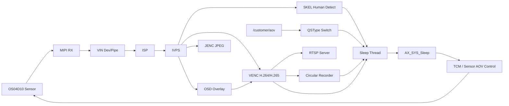
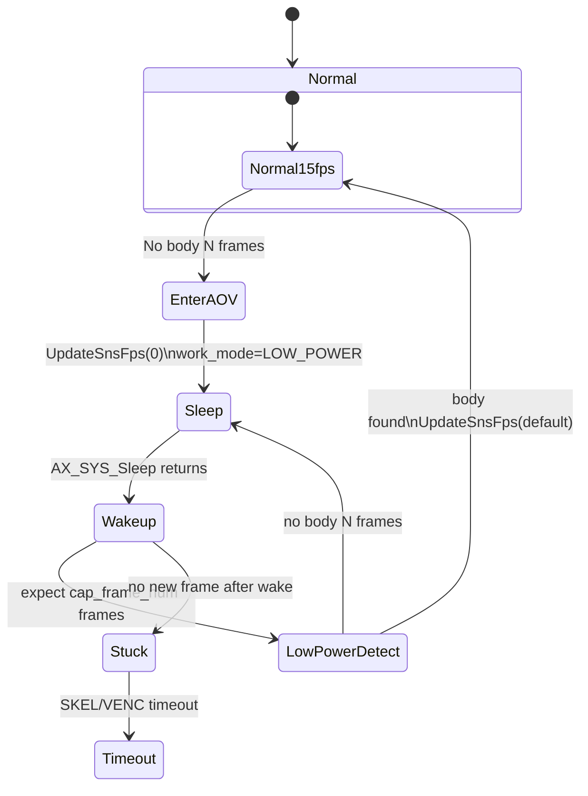

# QSDemo AOV 分析与框图

## 1. 结论

当前 `QSDemo` 的问题不是启动失败，而是：

- 正常启动时，`VIN -> IVPS -> SKEL/VENC/JENC/RTSP` 链路是通的
- 进入 `QSAOV` 后，系统确实执行了 `AX_SYS_Sleep()`
- `AX_SYS_Sleep()` 返回后，`QSDemo` 进入了 `Wakeup` 分支
- 但 **wake 后没有新帧再进入 IVPS/VENC/SKEL**
- 所以现象变成：
  - `RTSP` 拉不出流
  - `SKEL` 打印 `had not got frame over 2s`
  - `VENC` 打印 `no frame output long time`

这不是 `RTSP` 本身的问题，而是 **wake 后前端图像输入没有恢复**。

---

## 2. 现象与日志对应

你提供的日志说明了完整链路：

- 启动正常
  - `pipe[0] AX_ISP_StreamOn done`
  - `Detect[0] 1st frame seqno: 1`
  - `Venc[0]: 1st packet seqno: 1`
  - `Jenc[2]: 1st image is saved`
- AOV 生效
  - `qstype=qsaov`
  - `AOV: Fall sleep...`
  - `AX_SYS_Sleep and wakeup after 3000 ms...`
  - `Sys Slept round[1]`
  - `Sys Wakeup round[1]`
- Wake 后断流
  - `SKEL[0] had not got frame over 2s, last seqno=164`
  - `venc no frame output long time`

这意味着：

- sleep 前最后还能拿到 `seqno=164`
- wake 之后没有新的 `seqno=165`
- 所以 wake 之后 **VIN/IVPS 没再给出新帧**

---

## 3. QSDemo 功能框图



---

## 4. AOV 状态机



---

## 5. 关键代码路径

### 5.1 启动链路

- `demo/QSDemo/src/com/qs_common_cam.c:308`
  - 打印 `StartPipe cfg`
- `demo/QSDemo/src/com/qs_common_cam.c:318`
  - 调用 `AX_VIN_StartPipe()`
- `demo/QSDemo/src/com/qs_common_cam.c:355`
  - `AX_ISP_StreamOn done`

这部分与你的日志一致，说明启动阶段没有问题。

### 5.2 AOV 标志检测

- `demo/QSDemo/src/qsdemo.c:2397`
  - 检测到 `/customer/aov` 后进入 `qstype=qsaov`

### 5.3 无人时进入 AOV

- `demo/QSDemo/src/qsdemo.c:2475`
  - `UpdateSnsFps(&g_entry_param, 0)`
- `demo/QSDemo/src/qsdemo.c:2487`
  - `g_bSleepFlag = AX_TRUE`
- `demo/QSDemo/src/qsdemo.c:2488`
  - `update_sleep_condition(CONDITION_MASK_SKEL, true)`

### 5.4 Sleep 线程

- `demo/QSDemo/src/qsdemo.c:596`
  - `QS_VideoRecorderWakeup(AX_FALSE)`
- `demo/QSDemo/src/qsdemo.c:612`
  - 调用 `AX_SYS_Sleep()`

### 5.5 Wake 通知

- `demo/QSDemo/src/qsdemo.c:528`
  - `g_bSleepFlag = AX_FALSE`
- `demo/QSDemo/src/qsdemo.c:529`
  - 打印 `Sys Wakeup round`
- `demo/QSDemo/src/qsdemo.c:532`
  - `QS_VideoRecorderWakeup(AX_TRUE)`

这里有一个关键点：**wake 通知里没有显式恢复 sensor/VIN 出帧**。

### 5.6 FPS/TCM 控制

- `demo/QSDemo/src/qsdemo.c:2325`
  - `tcm_sns_info.work_mode = LOW_POWER/NORMAL`
- `demo/QSDemo/src/qsdemo.c:2326`
  - 设置 `cap_frame_num`
- `demo/QSDemo/src/qsdemo.c:2333`
  - 只有 `NORMAL` 路径会调用 `ax_tcm_sns_wakeup(pipe)`

### 5.7 人检回调恢复正常模式

- `demo/QSDemo/src/qsdemo.c:2579`
  - 条件：`g_nLastFps == 1 && !g_bSleepFlag`
- `demo/QSDemo/src/qsdemo.c:2582`
  - `UpdateSnsFps(&g_entry_param, g_nSnsFpsDefault)`

也就是说，**只有在 wake 后已经拿到帧并且检测到人时，代码才会恢复到正常帧率**。

---

## 6. 根因分析

当前代码的依赖关系是：

1. 无人时调用 `UpdateSnsFps(..., 0)`，把系统切到 AOV 低功耗逻辑
2. `AX_SYS_Sleep()` 返回后，只清状态，不主动拉起前端出帧
3. 代码假设 wake 后会自动收到 `cap_frame_num` 帧
4. 收到这些帧后，`SKEL` 才能做人检
5. 只有人检到人，才会 `UpdateSnsFps(..., default)` 恢复正常模式

问题在于：对当前 `OS04D10 + 当前板级 AOV 控制方式`，第 3 步没有成立。

也就是：

- wake 之后没有新帧
- 没有新帧就没有 `SKEL` 回调
- 没有 `SKEL` 回调就不会恢复正常模式

这就形成了一个闭环：

**没有帧 -> 不能检测 -> 不能恢复 fps/stream -> 继续没有帧**

---

## 7. 推荐改法

### 7.1 推荐方案：在 Wake 通知里显式触发 sensor 唤醒

这是最符合当前 AOV 设计意图的修法。

目标不是 wake 后直接回 15fps，而是：

- wake 后先明确把 sensor 拉醒
- 让它至少吐出 `cap_frame_num` 帧
- 这些帧进入 IVPS/SKEL
- 若检测到人，再由现有逻辑恢复到正常模式

建议改在 `AX_NOTIFY_EVENT_WAKEUP` 分支，位置参考：

- `demo/QSDemo/src/qsdemo.c:528`

建议逻辑：

```c
#ifdef TCM_SUPPORT
for (AX_S32 i = 0; i < g_entry_param.nCamCnt; i++) {
    ax_tcm_sensor_info_t tcm_sns_info = {0};
    AX_S32 nRet = ax_tcm_sns_info_get(gCams[i].nPipeId, &tcm_sns_info);
    if (nRet == 0) {
        tcm_sns_info.cap_frame_num = g_entry_param.nCapNum == 0 ? 1 : g_entry_param.nCapNum;
        ax_tcm_sns_info_set(gCams[i].nPipeId, &tcm_sns_info);
    }

    ax_tcm_sns_wakeup(gCams[i].nPipeId);
    AX_VIN_SetCapFrameNumbers(gCams[i].nPipeId, g_entry_param.nCapNum == 0 ? 1 : g_entry_param.nCapNum);
}
#endif
```

建议同时加日志：

- `ax_tcm_sns_info_get/set` 返回值
- `ax_tcm_sns_status_query()` 的 `awake_sof_cnt/eof_cnt`
- wake 后 200ms / 500ms 的 `VIN statistics`

这样可以直接验证：

- 是 sensor 没起来
- 还是 sensor 起来了，但 VIN/IVPS 没收到帧

### 7.2 备选方案：Wake 后直接恢复正常模式

如果目标不是严格 AOV，而是“wake 后马上恢复 RTSP 预览”，那可以在 `AX_NOTIFY_EVENT_WAKEUP` 里直接：

```c
pthread_mutex_lock(&g_mutex);
UpdateSnsFps(&g_entry_param, g_nSnsFpsDefault);
pthread_mutex_unlock(&g_mutex);
```

这个方案的特点：

- 优点：更容易恢复 RTSP
- 缺点：AOV 低功耗流程被打断，wake 后马上回 15fps，功耗策略会变差

因此它更像 **功能性绕过**，不是首选。

---

## 8. 为什么我更推荐 7.1

因为从源码设计看，`QSDemo` 的原始意图很明确：

- sleep 前把 sensor 置为 `LOW_POWER`
- wake 后吐少量帧做检测
- 检测到人再恢复正常模式

也就是说，**wake 后恢复少量检测帧** 才是设计目标，而不是 **wake 后立刻回全速预览**。

所以更合理的改法是：

- 保持 `QSAOV` 的状态机不变
- 只补上 wake 后“显式拉起 sensor/吐帧”的动作

---

## 9. 建议的最小调试点

如果要继续定位，建议在下面几个位置加日志：

### Wake 通知后

- `demo/QSDemo/src/qsdemo.c:528`
  - 打印 `ax_tcm_sns_status_query()`
  - 打印 `ax_tcm_sns_info_get()`

### AOV 切换时

- `demo/QSDemo/src/qsdemo.c:2325`
  - 打印 `work_mode`
  - 打印 `cap_frame_num`
  - 打印 `vts_val`

### 取帧线程

- `demo/QSDemo/src/qsdemo.c:3203`
  - 当前已有 `SKEL had not got frame over 2s`
  - 可补当前 `g_nLastFps`、`g_bSleepFlag`、`g_nQSType`

---

## 10. QSDemo 是什么 Demo

从 `README` 和源码看，`QSDemo` 不是单纯的 `VIN` 样例，而是一个 **低功耗智能相机/AOV 快启 Demo**，主要包括：

- `VIN/MIPI/ISP`
- `IVPS`
- `SKEL` 人体检测
- `VENC/JENC`
- `RTSP`
- 循环录像
- `AOV sleep/wakeup`
- `无人检测后的 reboot / sleep` 策略

README 说明见：

- `demo/QSDemo/README.md:1`

---

## 11. 当前问题一句话总结

**QSDemo 的 AOV 状态机已经进去了，但当前 OS04D10 路径在 wake 后没有重新吐出检测帧，导致后续 SKEL/VENC/RTSP 全部断流。**

