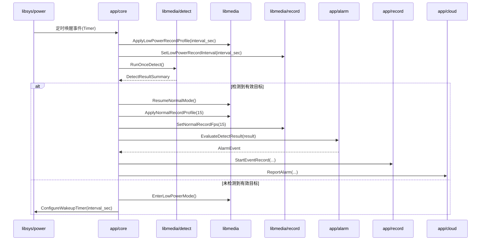
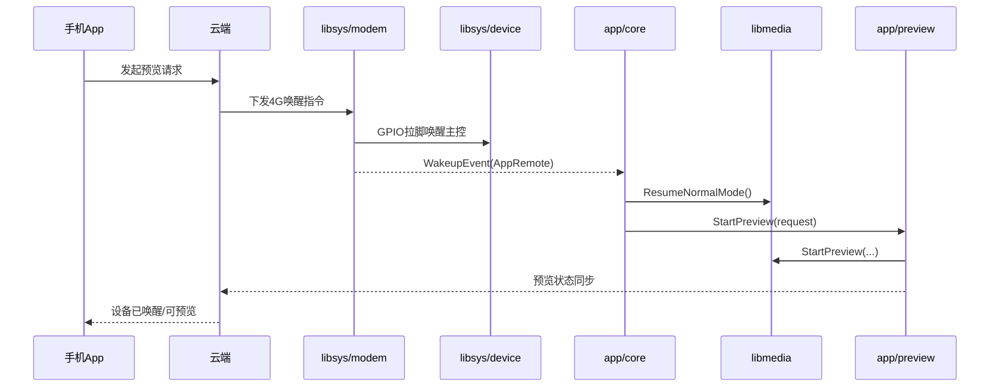
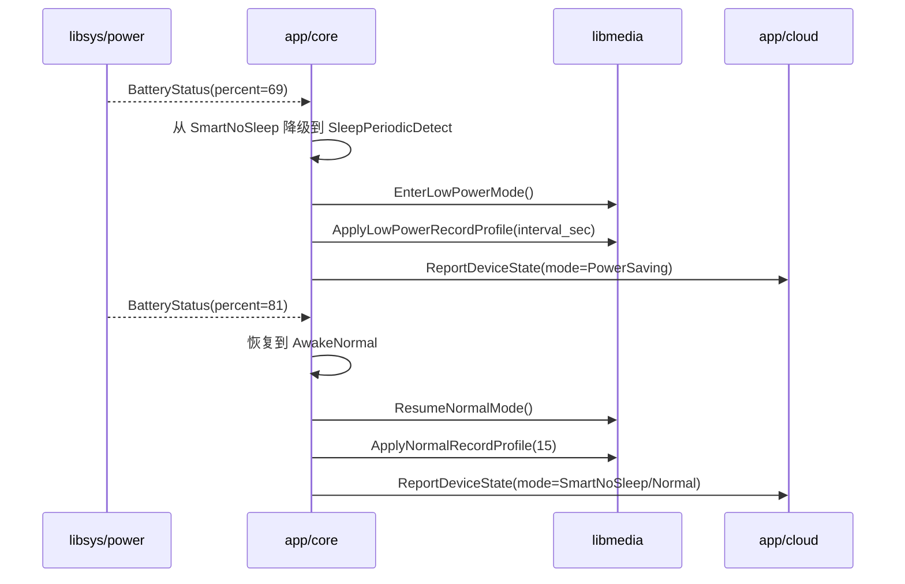
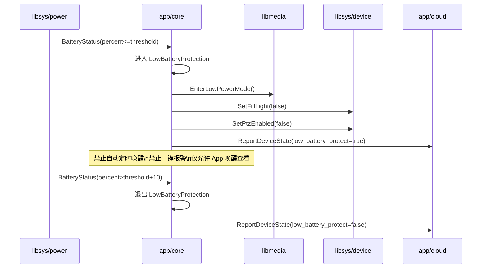
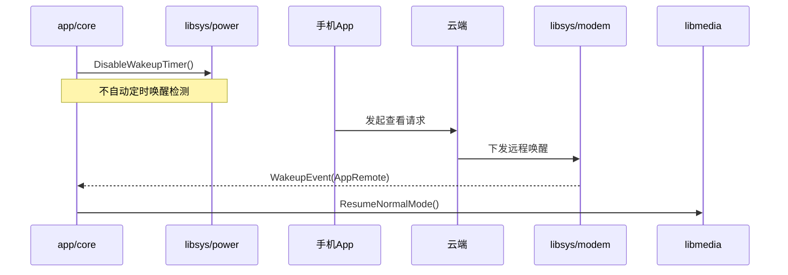
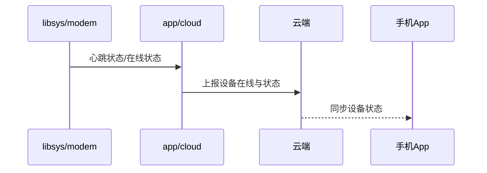

# code_v2 关键时序冻结稿

## 1. 文档目的

这份文档用于冻结 `code_v2` 第一阶段最关键的业务时序，避免后续编码时每个模块各自理解一套流程。

本文件重点覆盖：

- 工作模式流转
- 定时唤醒检测
- App 远程预览唤醒
- 4G 模组主动心跳
- 极低电量保护

---

## 2. 工作模式规则冻结

## 2.1 省电模式

- 使用定时唤醒检测
- 唤醒间隔：`1 / 3 / 5 / 15` 秒
- **录像间隔 = 定时唤醒间隔 = 低功耗取帧间隔**
- 无事件时按配置规格录像：例如 `1秒1帧`、`3秒1帧`
- 检测到有效事件后恢复常电链路，并切到 `15fps` 正常录像
- 无有效事件则返回休眠

## 2.2 智能不休眠模式

- 默认常电工作
- 电量 `< 70%` 降级到省电模式行为
- 电量 `> 80%` 恢复常电行为
- 后续仍受极低电量保护约束

## 2.3 超长待机模式

- 不自动定时唤醒检测
- 仅支持 App 远程唤醒查看

## 2.4 极低电量保护

- 电量低于保护阈值时进入
- 不自动定时唤醒
- 仅支持 App 唤醒查看
- 不支持云台操作
- 不支持一键报警
- 关闭补光灯
- 电量高于阈值 `+10%` 时退出

## 2.5 电池状态上报

- 充电状态需要上报云端
- 电池电量需要上报云端
- 云端再反馈给 App

---

## 3. 时序一：省电模式定时唤醒检测

**冻结结论**
- 定时唤醒属于 `libsys/power`
- 是否恢复常电由 `app/core` 决策
- 检测能力属于 `libmedia/detect`
- 低功耗录像规格由 `periodic_wakeup_interval_sec` 单一驱动
- 事件恢复后录像规格切到 `15fps`

---

## 4. 时序二：App 远程预览唤醒

**冻结结论**
- 云协议语义在 `app/cloud`
- 4G 模组和 GPIO 拉脚在 `libsys/modem` + `libsys/device`
- 预览会话在 `app/preview`
- 预览媒体链恢复在 `libmedia`

---

## 5. 时序三：智能不休眠模式电量降级/恢复

**冻结结论**
- 降级/恢复判断在 `app/core`
- 电池状态来源于 `libsys/power`
- 媒体链升降级在 `libmedia`
- 状态同步由 `app/cloud` 负责

---

## 6. 时序四：极低电量保护进入/退出

**冻结结论**
- 极低电量保护是运行时保护态，不是普通配置态
- 保护态能力裁剪必须落到接口行为上，不能只靠 UI 文案

---

## 7. 时序五：超长待机模式

**冻结结论**
- `UltraLongStandby` 下没有“检测自动唤醒报警”链路
- 仅保留 App 远程唤醒查看链路

---

## 8. 时序六：4G 模组主动心跳与状态反馈

**冻结结论**
- 模组侧在线状态归 `libsys/modem`
- 对云上报语义归 `app/cloud`
- App 不直接面对 4G 模组

---

## 9. 第一阶段实现时必须遵守的顺序

建议实现顺序：

1. 先实现事件和状态枚举
   - `ConfiguredWorkMode`
   - `RuntimeWorkState`
   - `WakeupSource`
   - `BatteryStatus`
2. 再实现 `app/core` 的状态流转骨架
3. 再接 `libsys/power` / `libsys/modem`
4. 再接 `libmedia/detect` / `libmedia/preview` / `libmedia/record`
5. 最后映射 QSDemo 的真实媒体/低功耗行为

---

## 10. 本阶段暂不冻结的细节

以下细节先不在本稿中定死，等接 QSDemo 实现时再确认：

- 省电模式下是否需要在无事件录像之外再额外保留 JPEG/缩略图
- 预览超时后是否立即回休眠，还是等待业务空闲窗口
- 多种检测类型同时触发时的告警优先级
- 心跳与业务状态上报是复用同一条消息，还是分开消息
